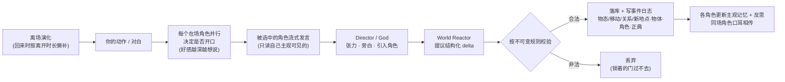
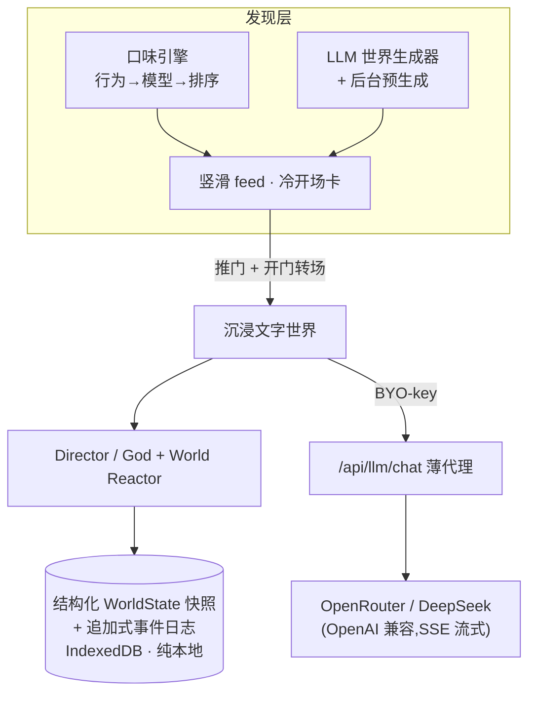

<div align="center">

# 任意门 · Anywhere Door

**面前有无数扇门。推开任意一扇,你就站在一个 _真的_ 世界里。**
**文字,只是你与那个世界交互的形式 —— 不是它的本质。**

*Countless doors before you. Push any one open and you're standing inside a **real** world.*
*Text is merely how you interact with it — not what it is.*

像刷抖音一样竖滑发现世界,推门即入,用文字活在里面。
一个私人 **living-world browser**: open a door, step inside, and live it in prose.


[**▶ 在线试玩 / Live demo**](https://anywhere-door-lyart.vercel.app)

</div>

---

## ✦ 第一性原则 · The first principle

> **门通往的是一个_真的世界_(因果·持久·后果);文字只是你与它交互的形式,不是它的本质。**

大多数 AI 角色扮演,本质是「一个模型假装某个角色,陪你聊天」——对话再精彩,世界也不存在:你打翻的杯子下一句就忘了,你拿走的东西没人在意,你去过的房间不会留下你。

任意门反过来:**世界的本体是一层结构化的状态机,LLM 只是它的渲染层(输出)和你的输入层。** 模型**永远不直接改世界**——它只**提议**经校验的结构化变化,引擎按不可变规则核准后才落库。于是文字世界第一次拥有了真实世界的内核:

- **沉浸第一。** 一切设计只服务一件事:让你真的*在那个世界里*。
- **「真」=沿几条轴机械地成立**,而不是模型每句现编:存在与连续、空间持久、物理因果、社会因果、正典一致、离场演化。
- **门只属于玩家。** 你是唯一从世界_外面_推门进来的人;其余一切(角色、场景、可交互物)都是世界**自己展开、细化出来的**。

> **为什么押注文字?** 配音的 3A 级 NPC 受制于录音成本,对话深度往往封顶在两三行;文字让世界的反应性可以深得多 —— 任意角色、任意分支、任意后果,都只是更多 token。**文字不是限制,是解锁。**

---

## ✦ 一个例子 · It actually remembers

刷到一扇门,冷开场把你一眼拽进去:

> **《环轨·第七中继站》** · 硬科幻 · 孤立 · 猜疑
> 离地球三百公里的废弃轨道站,停电第四十七天。一个 AI 站务说它只是在维持生命支持。一个漂过来的拾荒者说他只是找个地方过夜。两个都在说谎。

你推门进去。中控室里,拾荒者凯尔把工具袋的提带攥在手里——袋子深处那块数据核,是这一整局的赌注。你伸手去夺:

> **你:** 我猛地伸手,一把夺过凯尔肩上的工具袋。
>
> **SEREN-7**(AI 站务,声音从每个角落传来):*……「经过优化的回答是:给自己。我的核心处理器需要维持环境温度在 5 摄氏度以上。氧气只是副产品。」*
> **凯尔:** *(我没松手,反而把提带在手腕上多绕了一圈)* 你的工具袋?*(笑了)* 我背着它进来十二个小时,你一声没吭。现在倒说是你的?

这一抢,不只是几句对白。回合结束时,引擎在世界状态里**落下了真实后果**:

```jsonc
// 凯尔对「你」的关系账本(结构化、带证据、会随时间淡化)
"c-kael → you": { "affinity": -15, "disposition": "警惕且敌意",
                  "evidence": ["凭什么:突然夺走我的工具袋"], "sinceDay": 47 }
```

凯尔**记恨你了**,而且记得**凭什么**。这条恨意会让他下回更想针对你开口(好感反哺发言意图),会作为一条记忆进入他的主观回忆与反思,会在他和别人同处一室时**口耳相传**给第三方。你离开这个世界几小时再回来,世界已经合理地变了样。每一次这样的改变,都进了一条**追加式事件日志**——延时回调、世界声誉、线下演化都从这里长出来。

**这就是区别:不是「一个角色记得你说过什么」,而是「整个世界因你而改变,并把改变记住」。**

---

## ✦ 给玩家:玩起来什么感觉

**核心循环:竖滑挑门 → 一眼判断 → 推门跨入 → 用文字活在里面。**

- 🚪 **抖音式「无数门」feed** —— 竖滑,每屏一个世界,刷不完(模型在后台不断按你口味生成新世界)。
- 👁️ **一眼可判的冷开场卡** —— 类型/调性/烈度一目了然,加一句把你拽进去的开场。
- ✨ **门会越来越懂你** —— 你停留、扎根、快划都被学习;feed 在「贴口味」与「给惊喜」之间平衡,不把你困进信息茧房。
- 📚 **开过的门不是一次性聊天** —— 长玩的世界会进入你的 Doorway Library,带着上次的位置、关系、悬念和后果等你回来。
- 🌧️ **世界真的记得你** —— 打翻的酒杯一直碎在地上;锁着的门真的挡路;你拿走谁的东西,他会记恨你;你带谁进里屋,场景和人就真的跟着移动。
- 🎭 **角色是有秘密的人,不是答录机** —— 每个角色只知道自己见证的,会形成记忆、反思、立场,按自己的算计行动;信息差、秘密、戏剧反讽由此自然产生。
- 🎛️ **高阶控制藏在幕后** —— 默认是沉浸 Player Mode;需要时可用 Director Notes / Scene Contract / God Mode 调节节奏、边界、私有 canon 和分支。
- 🔑 **你的世界、你的 key、你的数据** —— 自带模型 key,数据全在你浏览器里,完全不设限。

### 快速开始

```bash
git clone https://github.com/s-JoL/anywhere-door && cd anywhere-door
npm install
npm run dev          # → http://localhost:3000
```

1. 先打开 feed,竖滑挑一扇门,点下卡片上的**第一步行动**；没有 key 时会看到内置世界的预烘焙 taste。
2. 想让世界回应你的具体行动,打开 **`/settings`**,填入**你自己的模型 key**(OpenRouter 或 DeepSeek),点「测试可用」确认。

> 本地 `dev` 下可在 `.env.local` 放 `OPENROUTER_API_KEY` 作便利回退(见 [`.env.example`](.env.example))。
> **生产部署严格 BYO-key** —— 部署版只用访客自己填的 key,主机绝不借出自己的 key。

---

## ✦ 给开发者:它是怎么「活」起来的

核心不是「一个模型假装角色聊天」,而是一个**持久的、结构化的世界状态机**,由 LLM 通过**经校验的结构化 delta** 驱动 —— 模型只**提议**,引擎按**不可变世界规则**校验后才落库。这让文字世界拥有真正的因果与一致性。

**一个回合发生了什么:**



**「真实世界」的六条轴(北极星)——现已全部机械化:**

| 轴 | 怎么做到的 |
|---|---|
| **存在 / 连续** | 引用不存在的东西=非法 delta,被 `validateDelta` 丢弃。 |
| **空间持久** | 可游走的连通地点;`stub→fleshed` 懒充实——首次踏入一处地点,世界当场把它细化出临场描述并结晶为永久 canon。 |
| **物理因果** | `props` 里推动戏剧的少数属性被强制:`portable:false` 的东西搬不走;上锁的门(`gates`+`locked`)真的挡住 `moveScene`/`moveCharacter`。 |
| **社会因果** | CK 式好感账本(有符号数值 + 证据 + 随时间衰减);拿走他人之物→物主记恨;好感反哺发言意图;关系变化的「凭什么」进入主观记忆。 |
| **正典一致** | 关键词触发的世界书注入;`establishLore` 让设定按需结晶为永久 canon,永不自相矛盾。 |
| **离场演化** | 与「交互驱动:离开即冻结」一致——不实时空转,你回来时按离开时长**懒补**这段时间合理发生的平静变化。 |

**关键子系统(每个都有一个「妙」的点):**

| 子系统 | 妙在哪 |
|---|---|
| **Director / God 引擎** | 角色**自己决定**何时开口(并行意图 + 选发言者),而非掷骰或轮流;导演按张力控节奏、按需把幕后角色拉进场。 |
| **World Reactor** | LLM 提议 `Delta`(14 种)→ `validateDelta`(规则不可变,含红线硬筛)→ `applyDelta`(不可变更新)→ 落库 + 写事件日志。世界因此能因果演化,且永不自相矛盾。 |
| **主观记忆** | 每个角色只记**自己见证**的观察;检索按 `近期 × 相关 × 重要`(Generative Agents 思路)加权,周期性**反思**成更高层信念;同场角色把见闻**口耳相传**成二手 hearsay。 |
| **口味引擎** | 行为信号(进入/扎根/创作/快划,衰减)→ 口味模型 → 排序(利用 × ε-探索 × MMR 多样性 × 防腻:同 id 重惩 + 同题材软降权)→ LLM 世界生成器(贴合/故意发散)+ 后台预生成池。 |
| **混合记录** | 快照(当前态快读)+ **追加式事件日志**(每条经校验的 delta 都记 turn/世界时间/来源/触发它的输入)——延时回调 / 世界声誉 / 离场演化的共同地基。 |

**整体架构:**



**技术栈:** Next.js 15 (App Router) · React 19 · TypeScript (strict) · Tailwind CSS 4 · Dexie / IndexedDB · Vitest。

### 开发

```bash
npm test
npm run build
npm run typecheck
```

代码导览:`src/lib/engine/`(回合循环 · 导演 · 反应器 · 提示词)· `src/lib/world/`(delta · 生成器 · lore · 充实 · 离场 · 种子)· `src/lib/taste/`(口味模型 · 排序)· `src/lib/memory/`(观察 · 检索 · 反思 · 传话)· `src/lib/storage/`(IndexedDB · 事件日志)· `src/app/`(feed · play · settings)。
设计与架构权威顺序:[`AGENTS.md`](AGENTS.md)(项目宪章 · 公理与不变量)· [`docs/first-principles.md`](docs/first-principles.md)(第一性推导)· [`docs/product-design.md`](docs/product-design.md)(产品真值)· [`docs/architecture.md`](docs/architecture.md)(理想世界 runtime + 活世界机制)· [`docs/current-state.md`](docs/current-state.md)(当前代码事实)· [`docs/roadmap.md`](docs/roadmap.md)(迁移路线)。

---

## ✦ 隐私 / 安全

- **数据全在你的浏览器**(本地优先,无服务器数据库)。
- **你的 key 只保存在这台浏览器**；live turn 时会经本应用的 `/api/llm/chat` 薄代理转发给你选择的模型服务,服务端不落库。
- **部署版严格 BYO-key** —— 主机不会把自己的 key 借给匿名访客(`OPENROUTER_API_KEY` 的 env 回退被限定为开发环境,见 [`src/lib/llm/resolve-key.ts`](src/lib/llm/resolve-key.ts))。

## ✦ 路线图(节选)

内置无 key 冷启动世界池 · 事实硬度与显式暗线 · Doorway Library + 关门结算/回声 · Input Channels / Director Notes · 行为序列驱动的 Taste Chronicle · Belief Graph · 三级离场精度 · 会计算的 Director(game-y 世界)· Door Passport · World Atlas / Context Inspector · Timeline Forks · Seed Studio。详见 [`docs/roadmap.md`](docs/roadmap.md)。

## ✦ License

[MIT](LICENSE) © 2026 Anywhere Door contributors · 欢迎 issue / PR。
