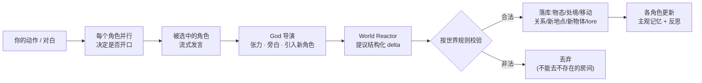
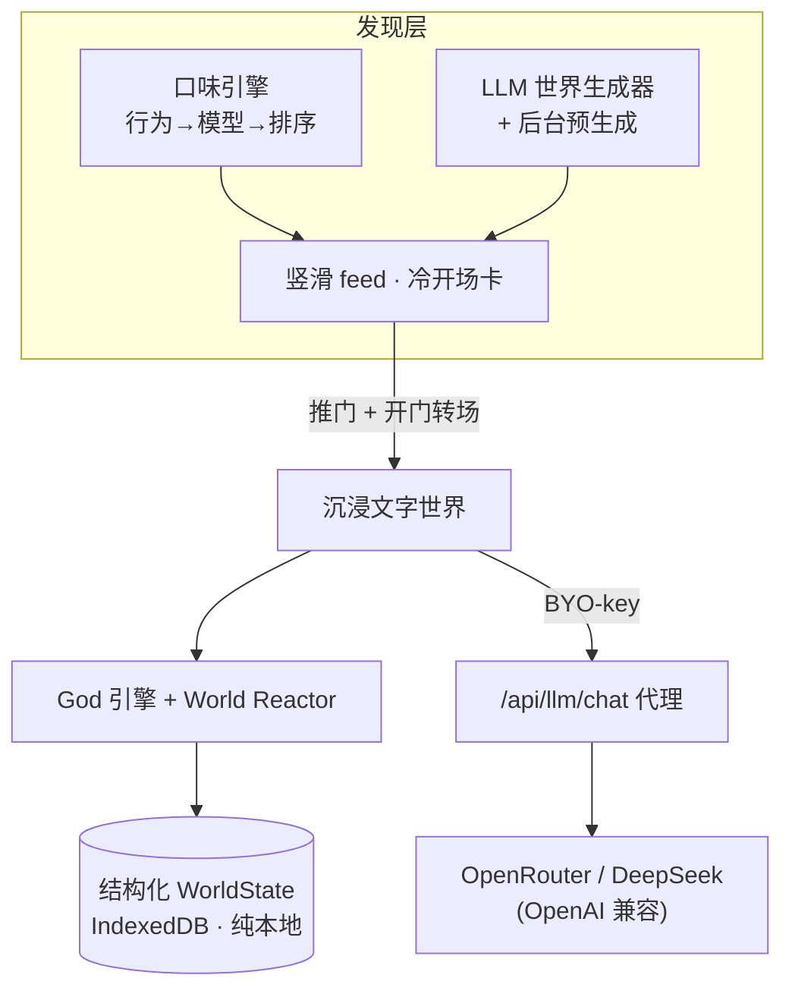

<div align="center">

# 任意门 · Anywhere Door

**面前有无数扇门。推开任意一扇,你就站在另一个世界里 —— 而那个世界,认得你。**

*Countless doors before you. Push any one open and you're standing in another world — and that world knows you.*

像刷抖音一样竖滑发现世界,推门即入,用文字活在里面。
An AI **living text-world** you swipe like TikTok — open a door, step inside, and play it out in prose.


</div>

---

推开一扇门,你看到的第一句话可能是:

> **《孤山·落雪客栈》** · 武侠 · 雨夜 · 危险
> 大雪封死了山路。你和她对坐,壶里的黄酒还剩半壶,她的手从没离开过剑柄 —— 而你知道得比她以为的要多得多。

> **《云隙茶寮》** · 治愈日常 · 温柔
> 你陷进靠窗的卡座里,膝盖上的毯子已经被体温焐出了恰到好处的重量。温茗把一杯焙茶往前又推了半寸……

> **《骸骨·第七层交易所》** · 黑市悬疑 · 记忆恐怖
> 你站在裂痕结算台前,左手背隐隐作痛。奈丝用琥珀色的眼睛看着你,声音像蜂蜜裹着碎玻璃:"这段分手记忆纯度很高……但,你真的不想再闻一次她的头发是什么味道吗?"

每一扇门都是这样一段**冷开场** —— 第二人称、悬在最勾人的一刻。你不读说明书,你**一眼就知道想不想进去**。而上面这些世界,有的是手写的,有的是模型按你的口味**现生成**的。

> **English** — Anywhere Door is a mobile-first, local-first web app for *living* AI text-worlds. Swipe a vertical feed of "doors" like TikTok, push one open, and step into a world that remembers you. A single **God engine** keeps a structured, persistent world and plays generative director — it advances only when you act, gives every character their own subjective memory, paces the drama, and pulls in new characters on demand. The medium is text, but the world's core behaves like reality: **causality, persistence, consequence.** Bring your own model key; everything lives in your browser. MIT licensed.

---

## ✦ 第一性原则

一扇通往**任意世界**、且**认得你**的门。

- **沉浸第一。** 一切设计只服务一件事:让你真的*在那个世界里*。
- **内核要像真实世界。** 媒介是文字,但世界遵循真实规律 —— 你做的每件事都在世界里留痕,并被后续记住。
- **门,既是发现,也是个性化,也是跨入。** 刷到的是门,门懂你的口味,推开就跨进去。

> **文字不是限制,是解锁。**
> 配音的 3A 级 NPC 受制于录音成本,对话深度往往封顶在两三行;文字让世界的反应性可以深得多 —— 任意角色、任意分支、任意后果,都只是更多 token。这就是我们押注文字的原因。

---

## ✦ 给玩家:它玩起来是什么感觉

**核心循环:竖滑挑门 → 一眼判断 → 推门跨入 → 用文字活在里面。**

- 🚪 **抖音式「无数门」feed** —— 竖滑,每一屏一个世界,刷不完(模型在后台不断生成新世界)。
- 👁️ **一眼可判的冷开场卡** —— 类型/调性/烈度一目了然,加一句把你拽进去的开场。
- ✨ **门会越来越懂你** —— 你停留、扎根、快划,都会被学习;feed 在"贴合你口味"和"给你惊喜"之间平衡,不让你困在信息茧房。
- 🌧️ **世界真的记得你** —— 打翻的酒杯会一直碎在地上;淋着雨进门,有人会递给你毛巾;你推开挡路的人,他会记恨你;你带谁走进里屋,场景和人就真的跟着移动。
- 🎭 **角色是有秘密的人,不是答录机** —— 每个角色只知道自己看到的,会形成记忆、反思、立场,按自己的算计行动。
- ↻ **不满意就重来这一拍** —— 重生成上一条会回滚消息、世界状态和本回合记忆,再用同一个动作展开另一版。
- 🔑 **你的世界、你的 key、你的数据** —— 自带模型 key,数据全在你浏览器里,完全不设限。

## ✦ 快速开始

```bash
git clone <repo> && cd anywhere-door
npm install
npm run dev          # → http://localhost:3000
```

1. 打开 **`/settings`**,填入**你自己的模型 key**(OpenRouter 或 DeepSeek),点「测试可用」确认。
2. 回到 feed,竖滑挑一扇门,**推门进入**。

> 本地 `dev` 下,可在 `.env.local` 放 `OPENROUTER_API_KEY` 作便利回退(见 [`.env.example`](.env.example)),省去每次粘贴。
> **生产部署不内置任何 key,纯 BYO-key** —— 部署版只会用访客自己填的 key。

---

## ✦ 给开发者:它是怎么"活"起来的

核心不是"一个模型假装某个角色聊天"。核心是一个**持久的、结构化的世界状态机**,由 LLM 通过**经校验的结构化 delta** 来驱动 —— 模型永远不直接改世界,它只**提议**变化,引擎按**不可变的世界规则**校验后才落库。这让文字世界拥有真正的因果与一致性。

**一个回合发生了什么:**



**关键子系统(每个都有一个"妙"的点):**

| 子系统 | 妙在哪 |
|---|---|
| **God 引擎** | 角色**自己决定**何时开口(并行意图 + 选发言者),而非掷骰或轮流;导演按张力控节奏、按需把"幕后"角色拉进场。 |
| **World Reactor** | LLM 提议 `Delta` → `validateDelta`(规则不可变)→ `applyDelta`(不可变更新)。10 种 delta:物态/处境/移动/时间/关系/**按需新建地点·物体·lore**。世界因此能因果演化,且永不自相矛盾。 |
| **主观记忆** | 每个角色只记录**自己见证**的观察;检索按 `近期 × 相关 × 重要`(Generative Agents 思路)加权,并周期性**反思**成更高层信念。信息差、秘密、戏剧反讽由此自然产生。 |
| **口味引擎** | 行为信号 → 衰减口味模型 → 排序(**利用 × ε-探索 × MMR 多样性 × 防腻**)→ **LLM 世界生成器**(贴合/故意发散,避免局部最优)+ 后台预生成池。 |
| **Lorebook** | 关键词触发的正典注入;`establishLore` 让世界设定**按需结晶**为永久 canon。 |

**整体架构:**



**技术栈:** Next.js 15 (App Router) · React 19 · TypeScript (strict) · Tailwind CSS 4 · Dexie / IndexedDB · Vitest。

### 开发

```bash
npm test
npm run build
npm run typecheck
```

代码导览:`src/lib/engine/`(回合循环 · 导演 · 反应器 · 提示词)· `src/lib/world/`(delta · 生成器 · lore · 种子)· `src/lib/taste/`(口味模型 · 排序)· `src/lib/memory/` · `src/app/`(feed · play · settings)。
设计与架构(单一事实来源):[`docs/DESIGN.md`](docs/DESIGN.md) · 前瞻路线:[`docs/ROADMAP.md`](docs/ROADMAP.md)。

---

## ✦ 隐私 / 安全

- **数据全在你的浏览器**(本地优先,无服务器数据库)。
- **你的 key 只存在你这台浏览器,绝不上传。**
- **部署版严格 BYO-key** —— 主机不会把自己的 key 借给匿名访客(`OPENROUTER_API_KEY` 的 env 回退被限定为开发环境,见 [`src/lib/llm/resolve-key.ts`](src/lib/llm/resolve-key.ts))。

## ✦ 路线图(节选)

线下世界演化(离开后世界懒推进,回来补演化 —— 接口已留)· 世界级声誉/消息传开 · NPC 自治议程 · 系统化物体属性(可燃/上锁…)· 延时回调(早期选择隔很久不经意地重现)· 多人共享世界。详见 [`docs/ROADMAP.md`](docs/ROADMAP.md)。

## ✦ License

[MIT](LICENSE) © 2026 Anywhere Door contributors · 欢迎 issue / PR。
